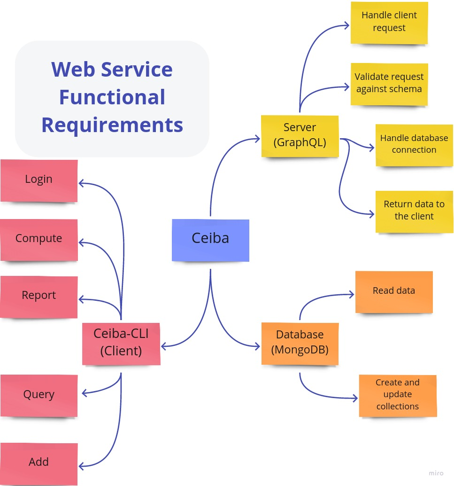

# Summary

Safe and efficient handling of large and complex data has become a critical part of many research projects.
In particular, many datasets containing the results of computationally expensive simulations are being assembled
in different scientific fields ranging from biology to material science. However, many research teams lack the proper
tools to collaboratively create, store and access datasets that are crucial for their research [@Wilson2017].
This lack of suitable digital infrastructure can lead to data loss, unreproducible results, and inefficient resources
usage that hinders scientific progress. The *Ceiba* web service provides a technical solution for teams of researchers
to jointly run the simulations needed to create their dataset, organize the data and the associated metadata, and
immediately share the datasets with each other. With *Ceiba*, academic researchers can not only improve their
data-handling practices but also promote collaboration among independent teams in need of the same data set. 

# Statement of need

Many research projects require running a large number of computationally heavy but independent simulations. 
Those can be molecular dynamics simulations of proteins [@Proteins_benchmark],
material properties [@OQMD], fluid dynamics simulations with different initial conditions [@ERCOFTAC], etc.
Recent advances in machine-learning have stimulated the creation of databases containing these types of calculations
and have highlighted the
importance of data quality and provenance as described by the FAIR data principle [@Wilkinson2016].
As the independent simulations grow in number, their orchestration and execution require a collaborative effort among a
team of researchers. Several platforms have already been developed to orchestrate large-scale collaborative efforts leveraging 
local computing resources [@SETI_at_home], [@Folding_at_home]. These platforms are technically very impressive but
offer, unfortunately, limited opportunity for reuse in smaller scale initiatives.

Here we present *Ceiba*, a light-weight library that aims to enable collaborative database creation by small and medium-sized teams.
*Ceiba* is implemented in Python using the Tartiflete GraphQL server [@Graphql;@Tartiflette].
*Ceiba* orchestrates the interaction between 3 distinct components: the client, the server and the database.
The scheme in Figure \ref{fig:architecture} represents the architecture of the web service. 

The *Ceiba web service* has been designed as a two-level service: one for managing the jobs generating
the data and another for handling the actual data. This partition allows to keep a clear boundary between
the metadata and provenance of a given job, from the concrete datasets. Since these two layers are independent,
*Ceiba* users can also manage data without associated jobs; for example,
the data has been previously computed and users just want to share it among themselves.

We use docker [@Docker] to set up and run both the server and the database in their own isolated and independent
Linux containers. The server and database containers are deployed using docker-compose [@Dockercompose] and they
communicate with each other using their own internal network [@Dockernetwork]. The docker-compose tool makes sure that
the server is listening to client requests in a given port (e.g. 8080 by default) and the database is stored
on the host computer where the docker containers are running, so it can be periodically backed up.
*Ceiba* uses MongoDB [@Mongodb] as backing database. Using a non-SQL database like MongoDB helps to
manipulate semi-structured data, like JSON files, without having to impose a schema over the simulation data.

Since both the server and the database need some computational resources to run, we anticipate that both
the server and database can be deployed at a local/national or cloud computing infrastructure. 
Once the server is up and running, users can install the client (*ceiba-cli*) on their local computer,
national computing infrastructure, cloud, etc. 

Using the client (*ceiba-cli*) the user can interact with the server and perform actions like:

* store new jobs in the database
* request some jobs to compute
* report job results
* query some available data
* perform administrative tasks on the database

Notice that in order to keep the data safe, it is required for users to log in to the Ceiba web service.
Since managing our own authentication system takes considerable time and resources, we use the
GitHub authentication system [@Authentication] to authenticate users on behalf of the Ceiba Web service. Users just
need to have a GitHub account and request a personal access token [@Token].

Once the user has authenticated with the web service, she can add new jobs by calling the client (`ceibacli add`)
with a JSON input file specifying the parameters to run the simulation. Similarly, the user can request through
the command line interface the parameters to compute new data points (`ceibacli compute`). This last command
will fetch from the server the parameters to run a specific calculation and it will feed them to the executable
provided by the user, as part of the input for the `compute` command. Finally, the client will run the job locally
or on the resources specified by the user (cluster/cloud etc.). Notice that when a user requests to compute a job,
that job is no longer available for other users and will remain in an *in-progress* state until its corresponding
results are reported or a given amount of time has passed without receiving the results. This reservation mechanism
ensures that two users do not compute the same datapoint, saving computational resources and human time.

Having run the requested jobs, the user can easily upload (using `ceibacli report`) the results and their metadata in
the server. In addition, the user can retrieve available datapoints from the database 
(using `ceibacli query`) at all times. The example section will provide a hands-on ilustration of the aforementioned actions.

Optionally, *Ceiba* allows you to store large binary/text objects using the Swift OpenStack data
storage service [@Openstack]. Large objects are not suitable for storage in a database but the 
Swift service allows to handle these kinds of objects efficiently. The only drawback of this approach
is that users need to request (and pay) for the cloud infrastructure necessary to provide this extra
service.


{ width=90% }


# Examples

We present in this section a simple example illustrating the use of *Ceiba*. For a more comprehensive discussion
about how to interact with the web service, see the Ceiba-CLI documentation [@Ceiba_CLI].

## Deploying the server and the database
Before using *Ceiba* the administrator of the server, Adam, must deploy the server and database.
While in a real application both the server and database will most likely be hosted on a cloud service, we will create for the sake of illustration
a couple of containers hosted locally.

In order to start the *Ceiba server*, Adam needs to install Docker [@Docker]
and Docker-compose [@Dockercompose]. Then he needs to clone the Ceiba repository [@Ceiba]
and go to the *provisioning* folder. Inside that folder he needs to define an environmental variable defining
the MongoDB password like:
```bash
export MONGO_PASSWORD="secure_password"
```
And now he can launch the server like:
```bash
docker compose up -d
```
The previous command will launch two containers to run in the background, one with the database and the other with the server.


## Adding jobs to the database
Once the server and the database are created, Adam must specify the jobs that his collaborators will
run to compute the different data points.

For this example, we will consider a simple case where we want to compute *Pi*; using the Monte-Carlo method.
To perform the simulations we will use [a Python code script called computepi.py](https://github.com/nlesc-nano/ceiba/blob/main/paper/computepi.py).
Each job parameter is the number of *samples* to estimate *Pi*;. 

Adam must define the jobs using a JSON file that looks like:
```json
  [
    { "samples": 100 },
    { "samples": 1000 },
    { "samples": 5000 },
    ........
  ]
```

Adam can then add the jobs to the database like:
```bash
ceibacli add -w http://localhost:8080/graphql -c monte_carlo -j jobs.json
```

## Requesting job and uploading the results

Now that the database is created, Julie, a collaborator of Adam wants to request 5 jobs to compute. But before requesting the jobs,
she must first log in in to the server:

```bash
ceibacli login -t ${LOGIN_TOKEN} -w "http://localhost:8080/graphql"
```
where `LOGIN_TOKEN` is a [read-only GitHub token to authenticate the user](https://ceiba-cli.readthedocs.io/en/latest/authentication.html#authentication).
Once the authentication step is complete, Julie can request jobs and run them with the following command:

```bash
ceibacli compute -i compute_input.yml
```

where ``compute_input.yml`` is a YAML file, containing the input to perform the computation. This input file looks like:
```yml
web: "http://localhost:8080/graphql"

collection_name: "monte_carlo"

command: computepi.py

max_jobs: 5
```

This command fetches 5 available jobs from the server that still need to be computed.
These jobs will now be marked as *in progress* in the server so that other collaborators cannot compute them.
By default, Julie's job are run locally but she can also provide a ``schedule``
[section in the input file](https://ceiba-cli.readthedocs.io/en/latest/compute.html),
if she wants to run the jobs using a job scheduler like slurm [@Jette2002].

After Julie invokes the ``compute`` command the jobs will be immediately run locally or remotely.
In the background, *Ceiba-CLI* takes each job's parameters and writes them down into YAML (or JSON) format.
*Ceiba* then calls the command that Julie has provided (here ``computepi.py``). Note that all these operations are 
orchestrated by *Ceiba* and they are invisible to users.

Once the jobs have finished, Julie can upload the freshly computed datapoints to the server by executing the following command:

```bash
 ceibacli report  -w http://localhost:8080/graphql -c monte_carlo
```
The jobs executed by Julie will now be marked as `Completed` on the server. Julie and other collaborators can keep on
requesting new jobs through the `ceibacli compute` command and report those results via `ceibacli report`.
Once there are no more jobs available, *ceiba-cli* will send a message declaring that there are not more jobs available
for running.

## Querying the database

At any point all the collaborators can obtain an overview of the current status in the server via:

```bash
 ceibacli query -w http://localhost:8080/graphql
```

This will return:

```
Available collections:
  name size
monte_carlo 7
```

indicating that there is currently one datasets called *monte_carlo* and it contains 7 data points.

If users want to retreive all the available data in *monte_carlo* they can use:
```bash
 ceibacli query -w http://localhost:8080/graphql --collection_name monte_carlo
```
that will create a `monte_carlo.csv` file containing the dataset.

The example presented above is, of course, trivial and does not necessitate the collaborative efforts of multiple people.
In real-life applications, for example, each job could be a type of computationally expensive calculation
like the quantum-mechanical simulation of the molecular properties of a given structure or
the molecular-dynamics-based simulation of the docking process between two large proteins.
We hope that for such cases, where each job can require up to several days of calculation on a super-computer,
*Ceiba* can provide an easy solution to orchectrate the creation of the database and ensure its consistency.


# Acknowledgements
Felipe would like to express his deepest gratitude to Stefan Verhoeven
for guiding him on the web developing world. We are also grateful to Jen Wehner
and Pablo Lopez-Tarifa for their support and feedback designing the Ceiba web service.

# References
